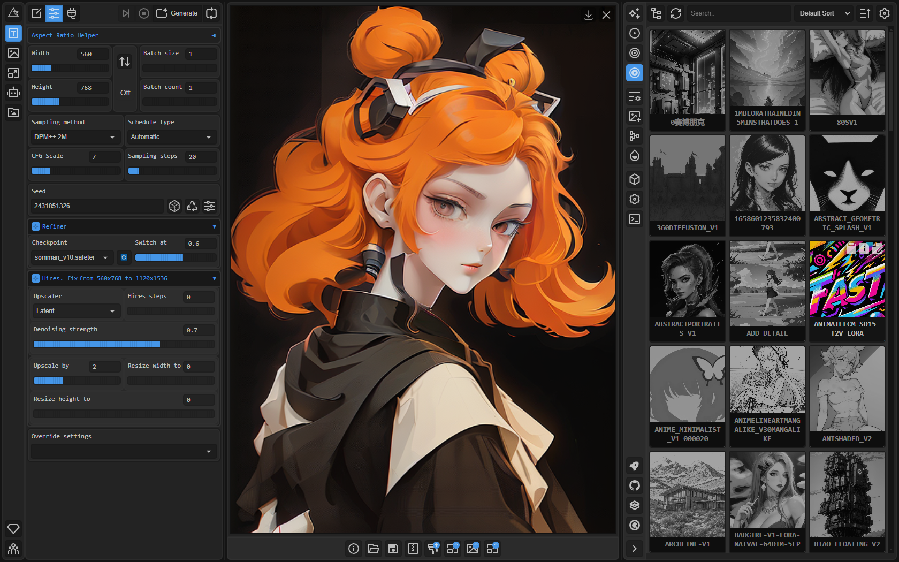

# Stable Diffusion WebUI UX Forge
A bespoke, highly adaptable, blazing fast user interface for Stable Diffusion, utilizing the powerful [Gradio](https://www.gradio.app/) library. This cutting-edge browser interface offers an unparalleled level of customization and optimization for users, setting it apart from other web interfaces.

Stable Diffusion WebUI UX Forge is build on top of [Stable Diffusion WebUI Forge](https://github.com/lllyasviel/stable-diffusion-webui-forge). It will sync with the upstream repository every 10 days.

[🌟 Your Support Makes a Difference! 🌟](https://buymeacoffee.com/dayanbayah)



## Optimizations
- **Redundant Checkpoints & Extra Networks**: Removing redundant Checkpoints and "Extra Networks" (Textual Inversion, Lora, and Hypernetworks) from img2img to reduce duplicated images and event listeners.
- **Inline Event Listeners**: Eradicating inline event listeners from "Extra Networks" cards and action buttons.
- **Event Delegation Pattern**: Applying an event delegation pattern to further streamline the code by consolidating event handling for "Extra Networks" cards and action buttons.
- **Optimized Stylesheets**: Enhanced visual coherence by substituting all default Gradio stylesheets in the DOM with an optimized version.
- **Inline Styles & Svelte Classes**: Improved efficiency by eliminating unnecessary inline styles and Svelte classes.

## Features Overview
- **Mobile Responsive Design**: Optimal display and usability across various devices.
- **Versatile Micro-Template Engine**: Leverage for enhanced functionality through other extensions.
- **Customizable Theme Styles**: User-friendly interface for theme customization.
- **Built-in Console Log**: Debugging capabilities for developers.
- **Production and Development Modes**: Dynamically compile the web UI UX using Vite directly from the interface.
- **Ignore Overrides Option**: Flexibility to maintain original settings when necessary.
- **Enhanced Usability for Sliders**: Input range sliders support tick marks for improved interaction.
- **Toggle Input Modes**: Switch between slider and numeric input modes for a compact interface.
- **Compatible with Gradio 3 and 4**: Works seamlessly with both Gradio 3 and Gradio 4 frameworks.

## Seamless UI Integration with Extensions
- **Infinite Image Browsing Extension**
- **Deforum Extension**
- **Prompt-All-In-One Extension**
- **Aspect-Ratio-Helper Extension**

  
## Todo
- Separate and organize CSS into individual files (in progress).
- Create documentation for developers on how to incorporate their components into various areas of the UI/UX.
- Implement fullscreen gallery functionality.
- Fork the Gradio project and contribute to enhancing their components.


## Advanced Theme Style Configurator (in progress)(upcoming feature)
A sophisticated theme editor allowing you to personalize any aspect of the UI-UX. Tailor the visual experience of the user interface with the Advanced Theme Style configurator.

[🌟 Get early access to Advanced Theme Style Configurator! 🌟](https://buymeacoffee.com/dayanbayah)


## Workspaces UI-UX (in progress)(upcoming feature)
The workspaces extension empowers you to create customized views and organize them according to your unique preferences. With an intuitive drag-and-drop interface, you can design workflows that are perfectly tailored to your specific requirements, giving you ultimate control over your work environment.

[🌟 Get early access to Workspaces! 🌟](https://buymeacoffee.com/dayanbayah)


## Installation and Running
Make sure the required [dependencies](https://github.com/AUTOMATIC1111/stable-diffusion-webui/wiki/Dependencies) are met and follow the instructions available for:
- [NVidia](https://github.com/AUTOMATIC1111/stable-diffusion-webui/wiki/Install-and-Run-on-NVidia-GPUs) (recommended)
- [AMD](https://github.com/AUTOMATIC1111/stable-diffusion-webui/wiki/Install-and-Run-on-AMD-GPUs) GPUs.
- [Intel CPUs, Intel GPUs (both integrated and discrete)](https://github.com/openvinotoolkit/stable-diffusion-webui/wiki/Installation-on-Intel-Silicon) (external wiki page)
- [Ascend NPUs](https://github.com/wangshuai09/stable-diffusion-webui/wiki/Install-and-run-on-Ascend-NPUs) (external wiki page)

### Automatic Installation on Windows
1. Install [Python 3.10.6](https://www.python.org/downloads/release/python-3106/) (Newer version of Python does not support torch), checking "Add Python to PATH".
2. Install [git](https://git-scm.com/download/win).
3. Download the stable-diffusion-webui repository, for example by running `git clone https://github.com/anapnoe/stable-diffusion-webui-ux-forge.git`.
4. Run `webui-user.bat` from Windows Explorer as normal, non-administrator, user.

### Automatic Installation on Linux
1. Install the dependencies:
```bash
# Debian-based:
sudo apt install wget git python3 python3-venv libgl1 libglib2.0-0
# Red Hat-based:
sudo dnf install wget git python3 gperftools-libs libglvnd-glx
# openSUSE-based:
sudo zypper install wget git python3 libtcmalloc4 libglvnd
# Arch-based:
sudo pacman -S wget git python3
```
If your system is very new, you need to install python3.11 or python3.10:
```bash
# Ubuntu 24.04
sudo add-apt-repository ppa:deadsnakes/ppa
sudo apt update
sudo apt install python3.11

# Manjaro/Arch
sudo pacman -S yay
yay -S python311 # do not confuse with python3.11 package

# Only for 3.11
# Then set up env variable in launch script
export python_cmd="python3.11"
# or in webui-user.sh
python_cmd="python3.11"
```
2. Navigate to the directory you would like the webui to be installed and execute the following command:
```bash
wget -q https://raw.githubusercontent.com/anapnoe/stable-diffusion-webui-ux/master/webui.sh
```
Or just clone the repo wherever you want:
```bash
git clone https://github.com/anapnoe/stable-diffusion-webui-ux-forge.git
```

3. Run `webui.sh`.
4. Check `webui-user.sh` for options.
### Installation on Apple Silicon

Find the instructions [here](https://github.com/AUTOMATIC1111/stable-diffusion-webui/wiki/Installation-on-Apple-Silicon).

